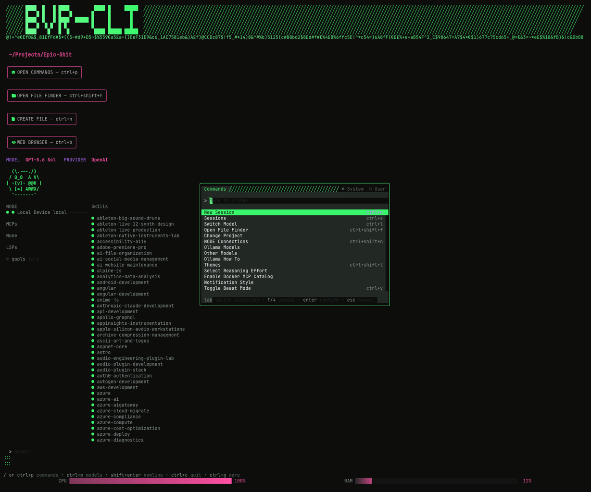
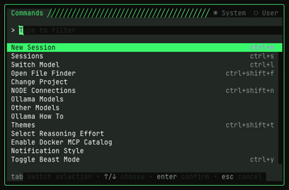

# BVR-CLI 1.2.4

**A keyboard-first AI workspace for the terminal.**

BVR-CLI brings conversations, project files, local models, tools, permissions,
skills, LSP, MCP, audio feedback, and multi-device NODE work into one fast
CLI/TUI cockpit.





## Why BVR-CLI?

AI development usually means bouncing between a terminal, model picker, file
browser, editor, browser, notification system, and a pile of helper scripts.
BVR-CLI is designed to make that whole loop feel like one application:

1. Open a project.
2. Choose a provider or local model.
3. Ask for work in the chat editor.
4. Review tool calls, permissions, files, and output in one place.
5. Continue from another device through the NODE architecture.

It is friendly enough for someone new to AI tools, while keeping the keyboard
shortcuts and escape hatches experienced developers expect.

## Quick start

Build and run the current checkout:

```sh
git clone https://github.com/richavery/bvr-cli.git
cd BVR-CLI
go run .
```

Or install the local build:

```sh
./scripts/install-bvr-cli.sh
bvr-cli --version
bvr-cli --help
```

Start in a specific project:

```sh
bvr-cli --cwd /path/to/project
```

For packaged macOS, Windows, and Linux installation paths, see
[`docs/installation.md`](docs/installation.md) and
[`docs/ONBOARDING.md`](docs/ONBOARDING.md).

## Feature set

### AI workspace

- Provider and model selection with model warm-up feedback
- Local Ollama discovery, pull, startup, and runtime status
- Streaming conversations with sessions and prompt history
- Permission and question flows that keep tool execution visible
- Agent Skills discovery, status, and project-aware workflows
- MCP servers, prompts, resources, and authentication flows
- LSP status and project diagnostics

### Project cockpit

- Project-aware File Finder with previews, metadata, hidden files, paging,
  clipboard support, and project switching
- Create-file flow from the homescreen and command menu
- Embedded web browser for research without leaving the TUI
- Shell/bang mode for quick command execution with streamed output
- Attach files, images, videos, links, and project resources from the editor
- Persistent project registration and recently accessed projects

### TUI and interaction design

- Keyboard-first controls with mouse support where it helps
- Animated Beaver identity mark and animated GGWave node-link visualization
- Responsive compact and wide layouts
- Gradient branding, status indicators, cursor effects, and resource meters
- Audio cues for startup, menus, prompt submission, chat responses, loading,
  permissions, errors, navigation, and long-running work
- Configurable notification style and safe audio volume controls (25/50/75/100% or silent)

### Nodes and multi-device work

BVR's NODE layer is intended for using the same workspace from multiple
devices. The project already contains HTTP/JSON, WebSocket, and SSH transport
designs, with a portable pairing envelope and a GGWave-inspired visual pairing
surface in the TUI. The native GGWave audio codec adapter is being kept
optional so the default cross-platform build remains CGO-free.

See [`docs/NODE_TRANSPORTS.md`](docs/NODE_TRANSPORTS.md),
[`docs/BVR-SERVER.md`](docs/BVR-SERVER.md), and
[`docs/GGWAVE.md`](docs/GGWAVE.md).

## Useful controls

| Action | Shortcut |
| --- | --- |
| Command menu | `Ctrl+P` |
| File Finder | `Ctrl+O` |
| Image Recognition | `Ctrl+B` |
| Models | `Ctrl+L` |
| Sessions | `Ctrl+S` |
| NODE settings | `Ctrl+Shift+N` |
| Themes | `Ctrl+Shift+T` |
| Beast Mode | `Ctrl+Y` |
| Help | `Ctrl+G` |
| Cancel/close | `Esc` |

The exact keymap is configurable and the command menu is the best place to
discover the complete action set.

## Development

BVR's release builds intentionally use a CGO-disabled toolchain for portable
cross-compilation.

```sh
gofmt -w .
go test ./...
go vet ./...
go build ./...
```

Package the supported targets with:

```sh
./scripts/package/build-all.sh 1.2.4
```

## Documentation

| Document | Purpose |
| --- | --- |
| [`docs/installation.md`](docs/installation.md) | Installation and troubleshooting |
| [`docs/ONBOARDING.md`](docs/ONBOARDING.md) | First-run setup and dependencies |
| [`docs/FEATURES-OVERVIEW.md`](docs/FEATURES-OVERVIEW.md) | Full feature inventory |
| [`docs/COMMAND-MENU.md`](docs/COMMAND-MENU.md) | Command palette items, SFX, and architecture |
| [`docs/LAUNCH_TASKLIST.md`](docs/LAUNCH_TASKLIST.md) | Release readiness and beta work |
| [`docs/BETA.md`](docs/BETA.md) | Beta testing and release process |
| [`docs/GGWAVE.md`](docs/GGWAVE.md) | GGWave pairing architecture |
| [`docs/BEAVER_MASCOT.md`](docs/BEAVER_MASCOT.md) | Animated Beaver states and layout contract |
| [`docs/NODE_TRANSPORTS.md`](docs/NODE_TRANSPORTS.md) | Multi-device transport options |
| [`docs/FILE_FINDER.md`](docs/FILE_FINDER.md) | File Finder behavior |
| [`docs/OLLAMA_HOW_TO.md`](docs/OLLAMA_HOW_TO.md) | Local Ollama setup |
| [`docs/SKILLS.md`](docs/SKILLS.md) | Agent Skills discovery and syncing |
| [`docs/CLINE_PROVIDER.md`](docs/CLINE_PROVIDER.md) | Cline provider integration |
| [`docs/UI_BRANDING.md`](docs/UI_BRANDING.md) | Visual identity and TUI branding |
| [`docs/PACKAGING.md`](docs/PACKAGING.md) | Installer and distribution reference |

## Beta feedback

When reporting an issue, include:

1. Operating system and CPU architecture
2. Terminal application
3. `bvr-cli --version` output
4. Launch command and project path
5. Provider/model configuration, if relevant
6. Reproduction steps and terminal output

Open an issue at [github.com/richavery/bvr-cli](https://github.com/richavery/bvr-cli).

## License

BVR-CLI is released under the MIT License. See [LICENSE.md](LICENSE.md).

**One terminal. Every project. A little more beaver.**
